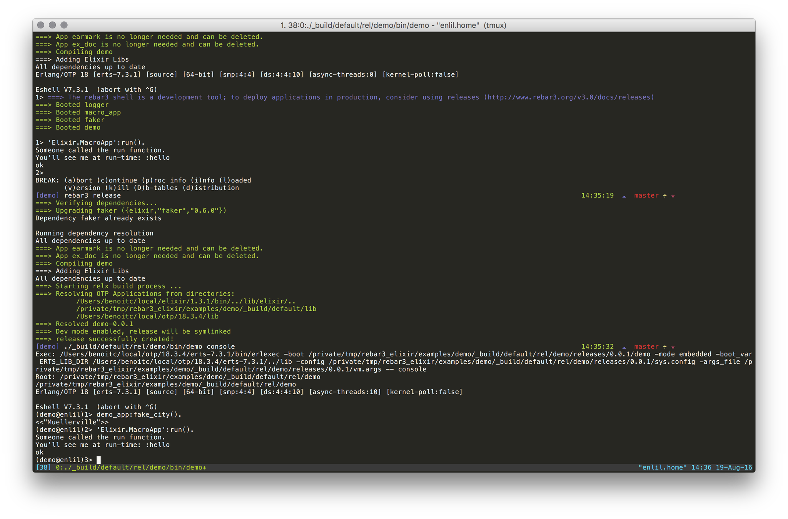

rebar3_elixir_compile
=====
[](https://hex.pm/packages/rebar3_elixir_compile)
A rebar3 elixir compiler plugin



Usage
-----

Add the plugin to your rebar config:

```erlang
{erl_opts, [debug_info]}.

{plugins, [
    { rebar3_elixir_compile, ".*", {git, "https://github.com/barrel-db/rebar3_elixir_compile.git", {branch, "master"}}}
]}.

{deps, [
   {faker, {elixir, "faker" ,"0.6.0"}}
]}.

{provider_hooks, [
  {pre, [{compile, {ex, compile}}]}
]}.

{elixir_opts, 
  [
    {env, dev}
  ]
}.
```

Full example in https://github.com/barrel-db/rebar3_elixir_compile/tree/master/examples/demo

Directory structure
--------
The plugin expects your mix applications to be present in `./elixir_libs`. All mix apps are automatically compiled along with their dependencies. 

The plugin also creates `./_elixir_build` to fetch and compile your dependencies specified in rebar.config.


Release 
-------
rebar3_elixir_compile supports releases out of the box. You just need to add a pre release provider hook in your rebar.config

```erlang
 {pre, [{release, {ex, compile}}]}  
```

Elixir lib dir
--------

rebar3_elixir_compile has auto discovery feature. It automatically loads Elixir, Mix and Logger from your Elixir installation. 

If you want to use the apps from another directory, you can add the following to elixir_opts in your rebar.config

```erlang
{lib_dir, "/usr/local/lib/elixir/lib/"},
{bin_dir, "/usr/local/bin/"}
```

